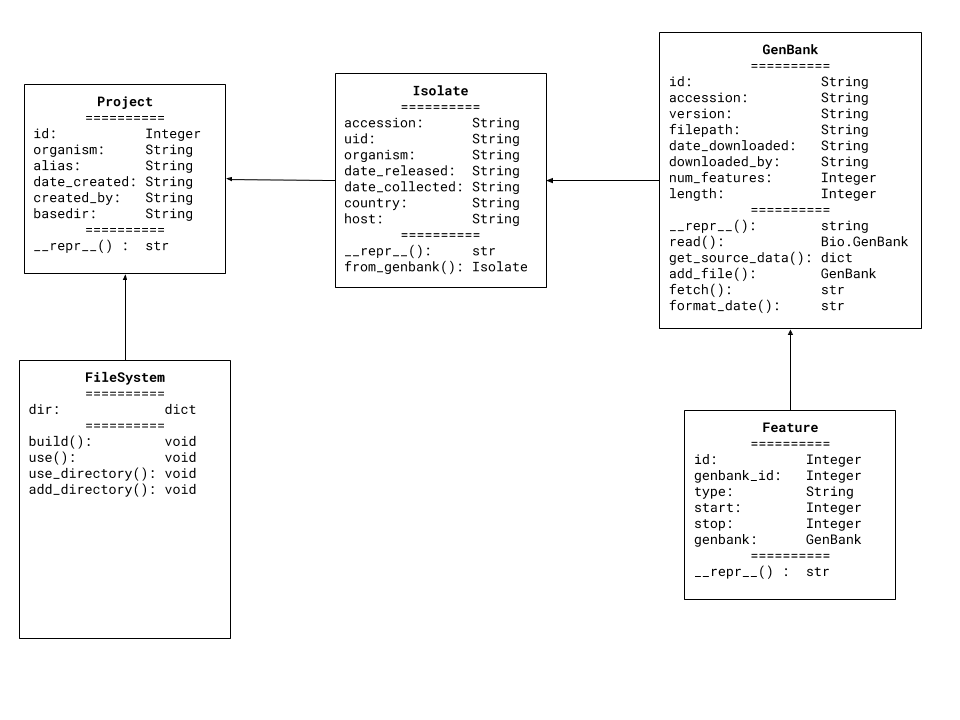

# SARS-COV-2
Data management and analysis of the SARS-CoV-2 virus (COVID-19)
### TABLE OF CONTENTS
#### UML DIAGRAMS
[Use Case](#use-case-uml)
[Classes](#class-uml)
### ABOUT
Written in Python using the Flask and SQLAlachemy frameworks.
... or any organism found in NCBI
### Use Case UML

### Class UML

