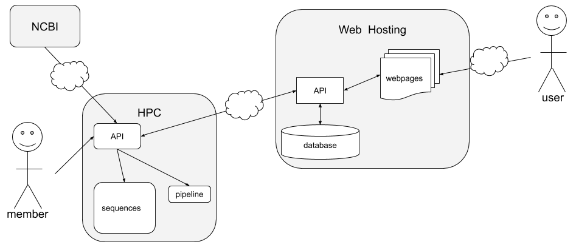

# Taxon Manager
Data management and analysis of the SARS-CoV-2 virus (COVID-19) or any other taxon

## TABLE OF CONTENTS
### [UML DIAGRAMS](#uml-diagrams)
- [Use Case](#use-case-uml)
- [Classes](#class-uml)

## ABOUT
Written in Python using the Flask and SQLAlachemy frameworks.
... or any organism found in NCBI
## UML Diagrams
### Use Case UML

### Class UML

